## hhplus-tdd-java

# 1. 동시성 이슈가 발생하는 원인

1. CPU 기계어 명령은 기본적으로 원자적 연산을 지원하지 않는다.
    1. 프로그램은 프로그램 코드를 CPU 기계어 명령어로 변환하여 연산하는데, 이 때 CPU 기계어 명령은 기본적으로 원자적 연산을 지원하지 않는다.
    2. 두 명령어 이상을 처리하는 경우 원자성을 보장하지 않으며 즉, 현재 수행 중인 명령어가 모두 실행되지 않은 상태로 인터럽트 될 수 있다.
    3. 결론적으로 CPU 에서 원자성을 보장하지 않는 모든 연산 처리는 스레드 간 동시 접근에 의해 데이터 불일치가 발생할 수 있다.
    4. 자바에서의 해결 방안 : Atomic 연산 객체

# [1] 동시성 이슈가 발생하는 원인
## (1) CPU 기계어 명령은 기본적으로 원자적 연산을 지원하지 않는다.

1. 프로그램은 프로그램 코드를 CPU 기계어 명령어로 변환하여 연산하는데, 이 때 CPU 기계어 명령은 기본적으로 원자적 연산을 지원하지 않는다.
2. 두 명령어 이상을 처리하는 경우 원자성을 보장하지 않으며 즉, 현재 수행 중인 명령어가 모두 실행되지 않은 상태로 인터럽트 될 수 있다.
3. 결론적으로 CPU 에서 원자성을 보장하지 않는 모든 연산 처리는 스레드 간 동시 접근에 의해 데이터 불일치가 발생할 수 있다.
4. 자바에서의 해결 방안 : Atomic 연산 객체

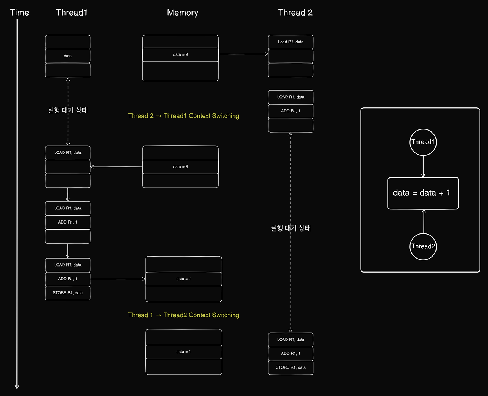

 

# (2) CPU 처리 데이터는 실시간으로 메인 메모리에 데이터가 저장되지 않는다.

1. 가시성(visibility) 은 멀티 스레드 환경에서 공유 변수의 변경 내용이 한 스레드에서 다른 스레드에게 어떻게 보이는지를 나타내는 개념이다.
2. CPU 가 데이터 연산 결과를 CPU 캐시에 반영 하더라도 실시간으로 메인 메모리에 반영하지 않기 때문에 발생한다.
3. 자바에서는 가시성 해결하기 위해 volatile 키워드를 사용했다. 공유 변수에 volatile 키워드를 사용하면 CPU 가 데이터 작업을 수행할 때 메인 메모리에서 공유 변수를 직접 읽어 수정된 결과를 메모리에서 즉시 반영하여 가시성 문제를 해결한다.
4. 스레드 공유 변수에 대한 가시성을 보장하면
   - N개 쓰레드 읽기::공유 변수::1개 쓰레드 쓰기 작업: 동시성을 보장하지만
   - N개 스레드 읽기::공유 자원::N개의 스레드 쓰기에 관한 동시성을 보장하지 않는다.

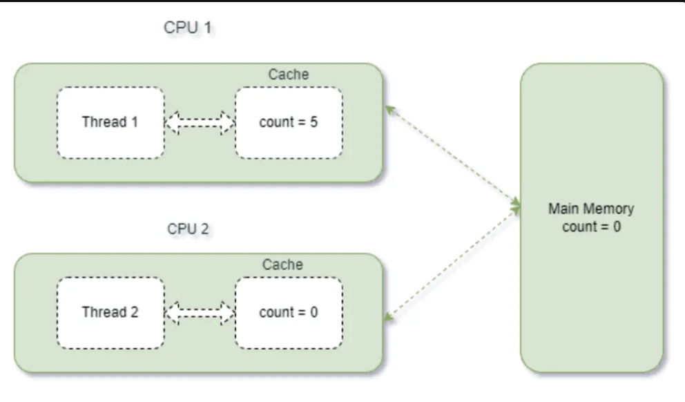

 

## (3) 스레드 세이프한 구조 (Thread Safe) 구조를 구성하면 동시성 문제를 방지할 수 있다.

- 임계 영역 동기화 : Lock 메커니즘
- 동기화 도구 사용 : semaphore, CAS, Atomic 변수, 동시성 자료구조
- 스레드 스택 한정 상태 관리 : 지역 변수, 지역 객체 참조
- 스레드 로컬
- 불변 객체 사용

# [3] 각 케이스 별 동시성 테스트 비교

포인트 소비/충전 동시성 테스트 코드는 아래와 같다

포인트 충전 동시성 테스트 코드
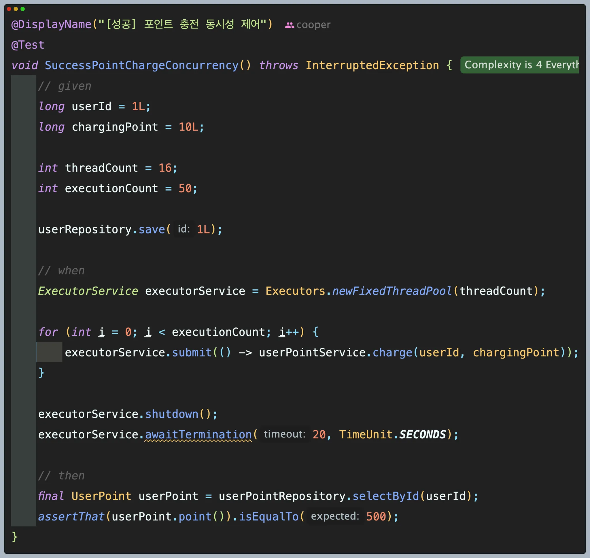

 

포인트 소비 동시성 테스트 코드
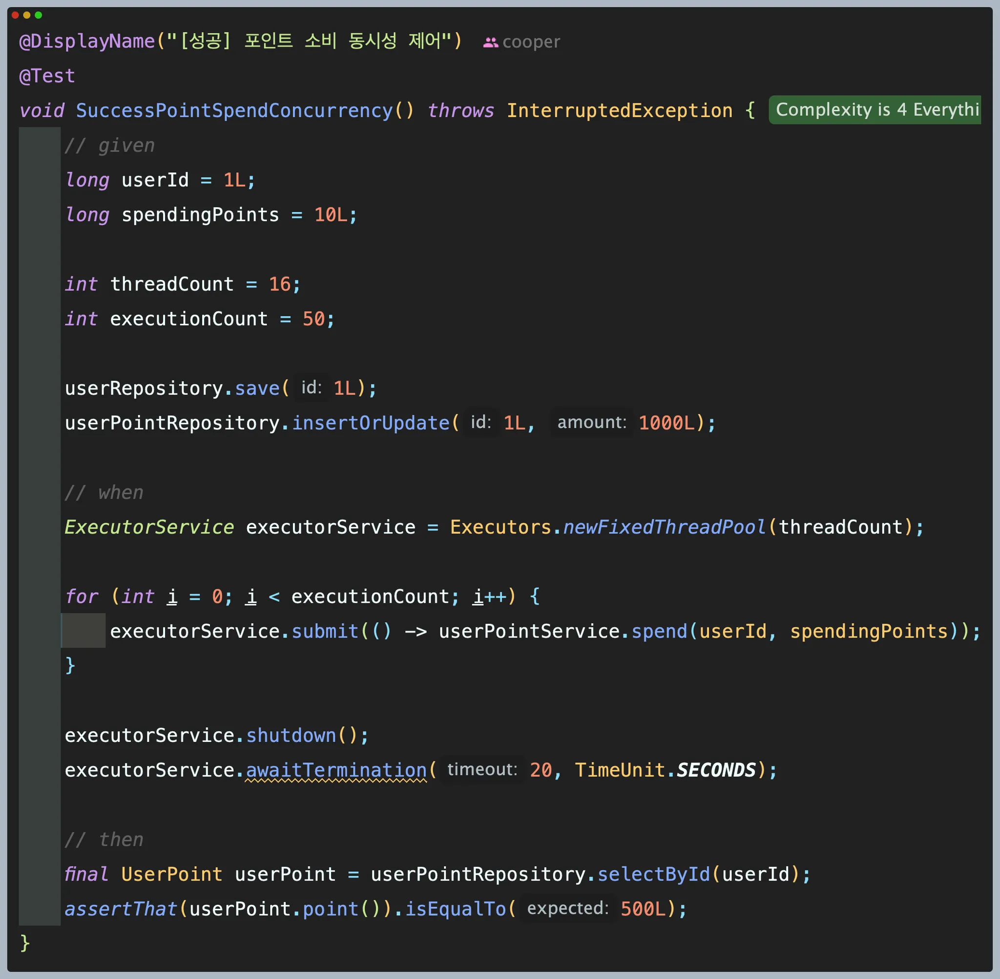

 

## (대조군) 동시성 실패 확인

1. 포인트 충전 코드를 16개의 스레드를 가진 스레드 풀을 통해 메서드를 호출시켰다.
2. 어떤 제어 방식도 사용하지 않아 예상대로 동시성 테스트는 실패했다.

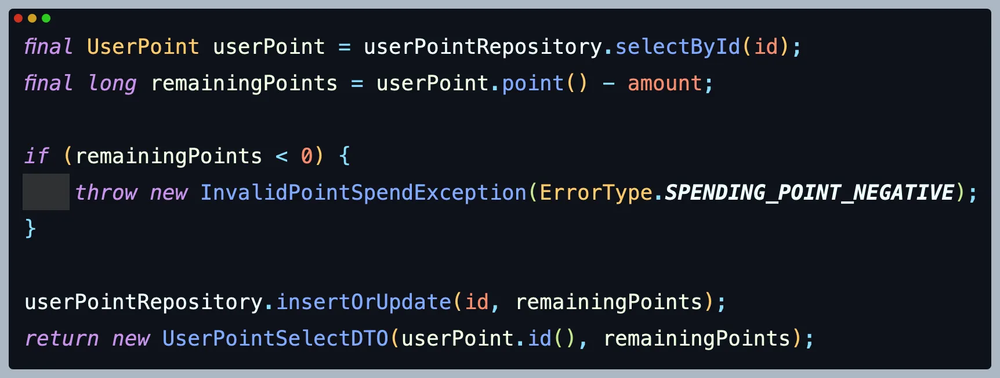

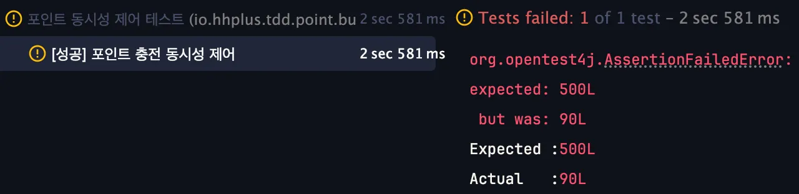

 

## 1. synchronized block 사용

1. 접근 방법
    - 임계 영역에 락을 사용해 스레드의 접근을 제어하여 경쟁 조건을 발생하지 않은 환경에서 연산을 실행하고자 했다.
2. synchronized 선택 이유
    1. synchronized 는 모니터 락(monitor-lock) 을 사용해 한 개의 스레드만 임계 영역에 접근을 허용하는 방법이다 . 단 한 개의 스레드만 접근을 허용하고 다른 스레드들은 블록(BLOCKED) 시키기 때문에 동시성 제어가 가능하다.
3. 테스트 결과
    1. 테스트는 5회 진행 및 평균 실행 시간은 14sec 으로 모든 테스트가 성공하였다.
4. 논의(Discussion)
    1. 단 하나의 스레드만 임계 영역에 접근이 가능하므로 동시성 이슈 발생하지 않는 환경에서 연산을 통해 테스트가 성공하였다.
    2. synchronized 가 느린 이유는 한 개의 스레드만 접근을 허용함에 인해 스레드들이 대기 상태로 전환되는 오버헤드가 원인으로 예상된다.

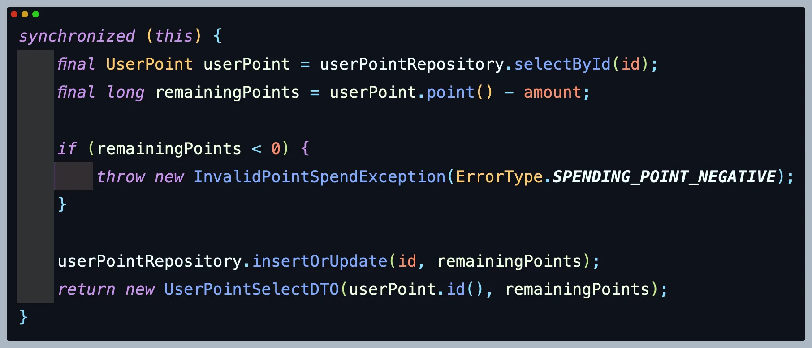

## 2. ReentrantLock

1. 접근 방법
    - 임계 영역에 락을 사용해 스레드의 접근을 제어하여 경쟁 조건을 발생하지 않은 환경에서 연산을 실행하고자 했다.
2. ReentrantLock.lock() 선택 이유
    1. ReentrantLock 은 **AbstractQueuedSynchronizer(AQS)** 기반으로 동작하는 락이며, ReentrantLock은 synchronized 보다 많은 옵션을 제공한다. 블로킹 / 논블로킹 기반 락 획득, 타임 아웃, 공정성 여부에 관한 기능을 제공해 락을 더 유연하게 사용 가능하다.
    2. 락 획득을 시도하는 스레드들은 블로킹 되어 있는 점은 유사하지만, 내부 동작의 차이로 인한  synchronized 퍼포먼스 차이를 확인하는 의도로 선택하게 되었다.
3. 테스트 결과
    1. 테스트는 5회 진행 및 평균 실행 시간은 13sec 으로 모든 테스트가 성공하였다.
    2. synchronized 와 비교했을 때 유의미한 결과를 확인하지 못했다.
4. 논의
    1. synchronized 와 ReentrantLock.lock() 을 비교했을 때, 비즈니스 로직의 복잡도가 낮은 경우, 락 획득/해제를 하는 synchronized 를 사용하는 것이 더 좋은 방법인 것 같다.

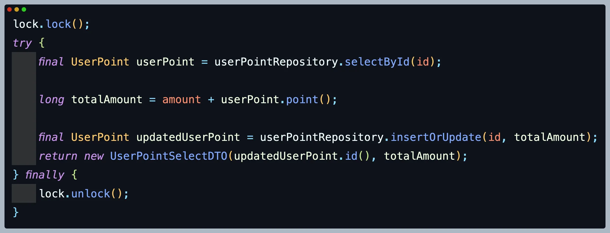

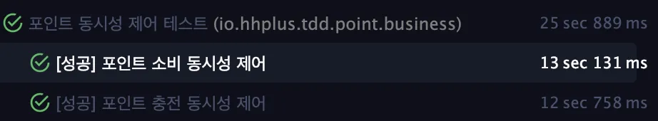

 

## 3. SpinLock

1. 접근 방법
    - 임계 영역에 스레드가 블록 상태로 전환 및 해제되는 오버헤드를 개선 포인트로 접근하고자 했다.
2. ReentrantLock.tryLock() 선택 이유
    1. ReentrantLock.tryLock() 은 논블로킹 기반으로 락 획득이 제공한다.
    2. 스레드의 RUNNNING 상태를 유지하고 획득과 동시에 락에 접근하여 블록 상태 전환으로 인한 오버헤드에 따른 테스트 소요 시간을 확인해보고 싶었다.
3. 테스트 결과
    1. 테스트는 5회 진행 및 평균 실행 시간은 13sec 으로 모든 테스트가 성공하였다.
    2. 블로킹 기반의 ReentrantLock.lock() 과의 유의미한 결과를 확인하지 못했다.
4. 논의
    1. 블로킹 기반의 lock() 메서드와 비교했을 때 유의미한 차이가 없었다.
    2. spin lock 은 CPU 자원을 낭비한다고 알려져 있기 때문에 적절한 방법은 아니라고 판단한다.
    3. 스레드 상태에 관한 오버헤드보다 임계 영역에 단일 스레드의 접근으로 인한 성능 저하로 예상된다.

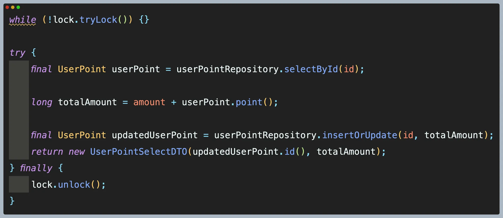

 

## 4.   ConcurrentHashMap<Long, Lock> 적용 (사용자 별로 락 관리하는 방법)

1. 접근 방법
    - 기존 ReentrantLock.lock() 과 크게 테스트 시간 차이가 없을 것으로 예상하지만,

      사용자 별로 락을 할당하고 요청에 관한 순서를 보장하는 의도하고자 했다.

2. ConcurrentHashMap<Long, Lock> 선택 이유 & 공정성(fairness) 추가
    - 사용자 별로 락을 할당하고 요청에 관한 순서를 보장하는 의도하고자 했다.
    - 공정성(fairness) 는 가장 오래 기다린 쓰레드가 락을 획득할 수 있도록 보장하는 옵션이다.

      공정성을 보장하는 반면 성능적으로는 비공정에 비해 떨어질 수 있다고 한다.

3. 테스트 결과
    1. 테스트는 3회 진행 및 평균 실행 시간은 19sec 으로 모든 테스트가 성공하였다.
4. 논의
    1. ConcurrentHashMap 에 관한 추가 로직으로 인해 테스트 시간이 6초 더 소요되었다.
    2. 테스트 소요 시간이 늘었지만 사용자의 요청 순서를 보장하는 장점이 있는 것으로 판단된다.

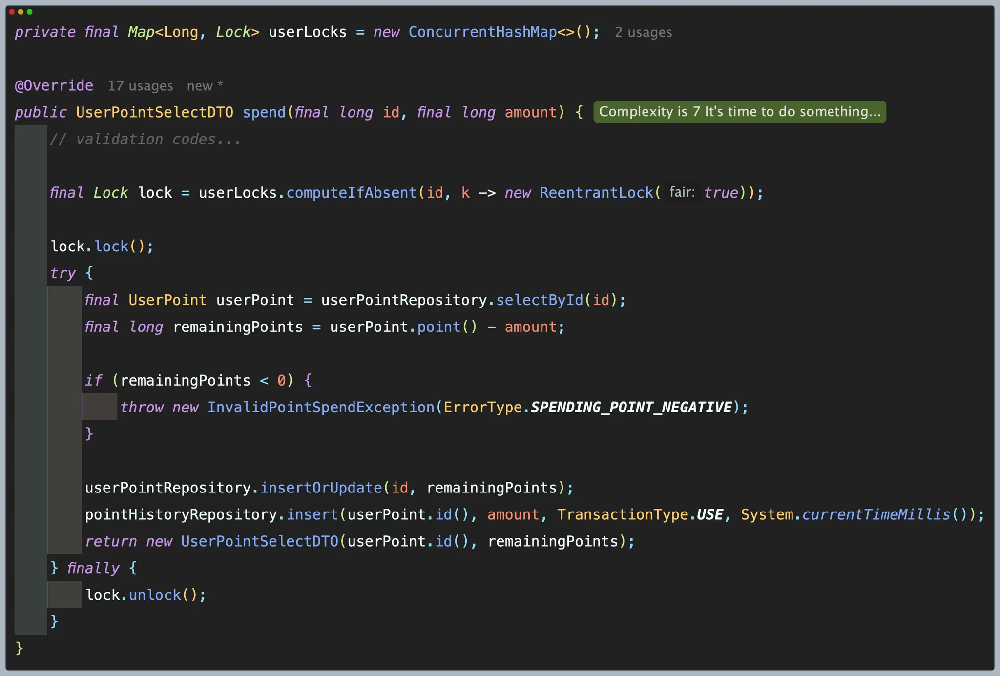

 

## 5. AtomicLong + ConcurrentHashMap

1. 접근 방법
    1. 동시성 이슈가 발생한 원인은 원자성을 보장하지 않는 자바 바이트 코드의 멀티 스레드 실행 과정에서 데이터 일관성이 깨지는 현상이라 예상했다.
2.  AtomicLong 을 선택한 이유
    1. 포인트 더하기, 빼기 연산의 원자성(Atomicity) 를 보장하고 싶었다.
    2. Atomic 클래스는 자바 바이트 코드 수준에서 원자성을 보장해 데이터 일관성이 깨지는 것을 방지할 수 있을 것이라 판단했다.
    3. AtomicLong 의 피연산자인 value 변수는 volatile 이 선언되어 있어 가시성(volatile) 을 보장하므로 가시성 문제에 관한 부분 또한 해결이 될 것이라고 판단했다.
3. ConcurrentHashMap 도입 이유
    1. 사용자 별 포인트의 원자적 연산을 보장하고자 사용자의 키를 기반한 ConcurrentHashMap<Long, AtomicLong> 을 이용해 코드를 작성했다.
    2. ConcurrentHashMap 는 경쟁 조건이 예상되는 부분에만 블록(block) 처리가 되어 있어 기존의 HashTable 보다 멀티 스레드 환경에서 안전하고 성능적인 이점이 있다고 한다.
4. 테스트 결과
    1. 테스트는 5회 진행 및 평균 실행 시간은 5sec 이내 였지만 데이터는 실패했다.
5. 논의
    1. 바이트 코드 수준의 연산의 원자성 보장을 통해 동시성을 보장할 것으로 예상했지만 실패했다.
    2. volatile 특성상, 다중 읽기 + 다중 쓰기에 관한 데이터 일관성을 보장하지 않아 AtomicLong 과 함께 사용하면 동시성을 해결될 것이라고 예상했지만 동시성을 완벽하게 재현하지 못하는 것 같다.
    3. 다른 소스 코드에서 원자성을 보장하지 않는 코드가 존재하는 것으로 예상되어 추가 개선 방안이 필요하다.

 

ConcurrentHashMap 선언
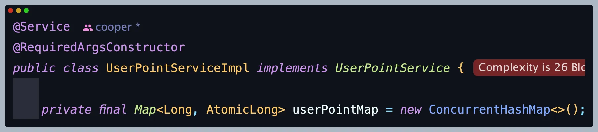

 

포인트 소비 코드
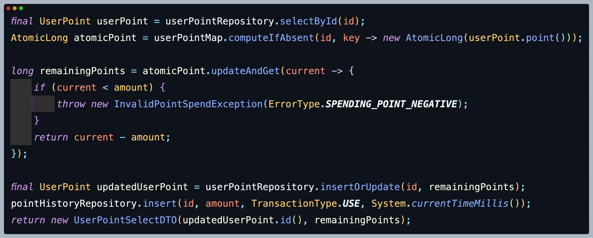

포인트 충전 코드
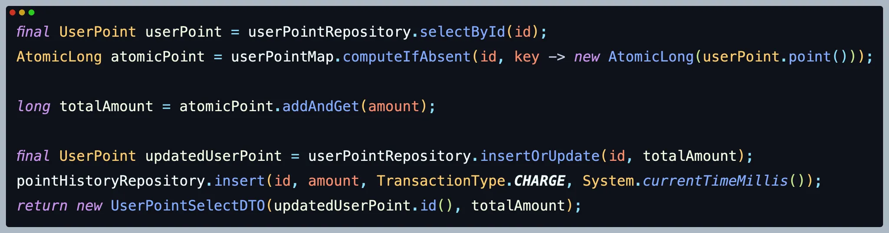

