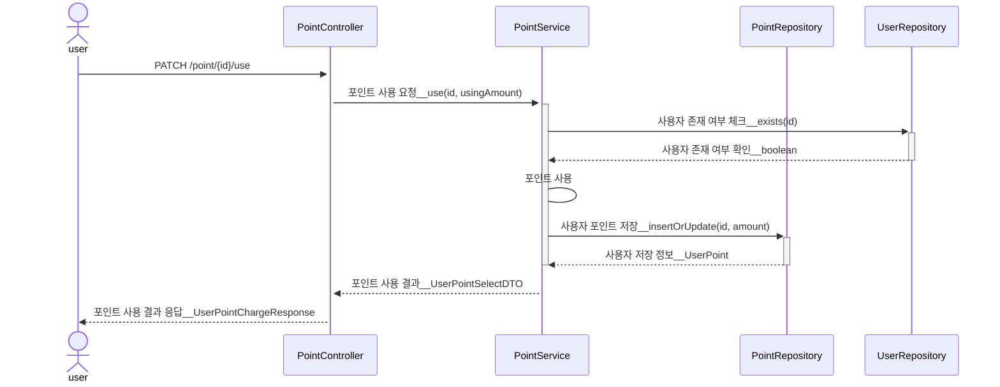
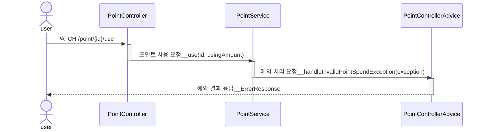
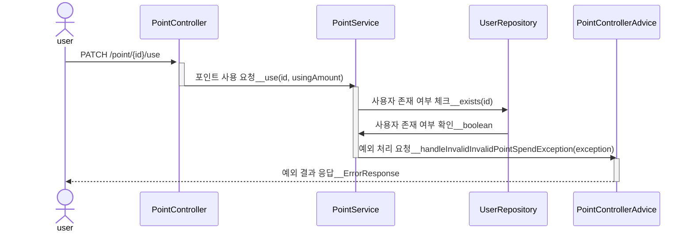
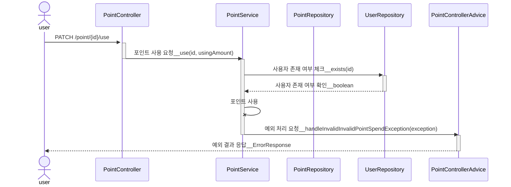

# [3] 유저 포인트 사용 API

## (1) 행동 분석

1. 사용 포인트, 유저 식별자를 파라미터로 입력 받는다.
2. 사용 포인트를 검증한다.
    - 사용 포인트는 양수이며, 1회 최대 사용 포인트는 10_000 이다.
        - 사용 포인트가 음수인 경우, 요청은 실패한다.
        - 사용 포인트가 0 인 경우, 요청은 실패한다.
        - 사용 요청 포인트 > 10_000 인 경우, 요청은 실패한다.
3. 유저 식별자를 검증한다.
    - 유저는 가입된 사용자여야 한다.
    - 유저 식별자는 양수이다.
        - 유저 식별자는 음수일 수 없다.
        - 유저 식별자는 0 일 수 없다.
4. 포인트를 사용한다.
    - 사용 요청 포인트는 유저가 소지한 포인트보다 작아야 한다.
        - 사용 요청 포인트 > 유저가 소지한 포인트인 경우, 요청은 실패한다.
        
5. 사용 결과를 응답한다.

## (2) 단위 테스트 케이스

### 1. PointService

| Pass/Fail |      type      |              input condition              | expected result                    |
|:---------:|:--------------:|:-----------------------------------------:|------------------------------------|
|   Fail    |     point      |               사용 요청 포인트 < 0               | 예외 반환 (InvalidPointSpendException) |
|   Fail    |     point      |              사용 요청 포인트 == 0               | 예외 반환 (InvalidPointSpendException) |
|   Fail    |     point      |         사용 요청 포인트 > 1회 최대 사용 포인트          | 예외 반환 (InvalidPointSpendException) |
|   Fail    |     point      |          사용 요청 포인트 > 사용자 현재 포인트           | 예외 반환 (InvalidPointSpendException)    |
|   Fail    |     userId     |                사용자 식별자 < 0                | 예외 반환 (InvalidUserIdException)     |
|   Fail    |     userId     |               사용자 식별자 == 0                | 예외 반환 (InvalidUserIdException)     |
|   Fail    |     userId     |             양수 && 사용자 식별자 불일치             | 예외 반환 (UserNotFoundException)      |
|   Pass    | userId & point | (사용자 식별자 > 0) && 사용자 식별자 일치 && 유효한 사용 포인트 | 포인트를 사용에 성공한다.                     |

### 2. PointController

| Pass/Fail |        |               user input                | expected status code | expected response body                                               |
|:---------:|:------:|:---------------------------------------:|:--------------------:|:---------------------------------------------------------------------|
|   Fail    | point  |               사용 포인트 < 0                |   bad request(400)   | {"code" : "POINT_USE01", "message" : "사용 포인트는 음수일 수 없습니다."}          |
|   Fail    | point  |               사용 포인트 == 0               |   bad request(400)   | {"code" : "POINT_USE02", "message" : "사용 포인트는 0일 수 없습니다."}           |
|   Fail    | point  |          사용 포인트 > 1회 최대 사용 포인트          |   bad request(400)   | {"code" : "CHARGING_POINT03", "message" : "1회 포인트 사용은 최대 만점 가능합니다."} |
|   Fail    | userId |               사용자 식별자 < 0               |   bad request(400)   | {"code" : "MEMBER01", "message" : "유효하지 않는 유저 식별자 입니다."}             |
|   Fail    | userId |              사용자 식별자 == 0               |   bad request(400)   | {"code" : "MEMBER01", "message" : "유효하지 않는 유저 식별자 입니다."}             |
|   Fail    | userId |       사용자 식별자 > 0 && 미등록 사용자 식별자        |   bad request(400)   | {"code" : "MEMBER02", "message" : "일치하는 유저가 존재하지 않습니다."}             |
|   Pass    | userId | 사용자 식별자 > 0 && 사용자 식별자 일치 && 유효한 사용 포인트 |       ok(200)        | {"id" : "1", "availablePoint" : 200}                                 |

## (3) 시퀀스 다이어그램

### 1. 응답 성공 시퀀스

### 2. 응답 실패 시퀀스 : 유효하지 않는 포인트 사용 요청 (음수, 0, 일회 최대 사용 포인트)

### 3. 응답 실패 시퀀스 : 미등록 사용자 요청

### 4. 응답 실패 시퀀스 : 사용자 사용 요청 포인트 > 사용자 현재 포인트

