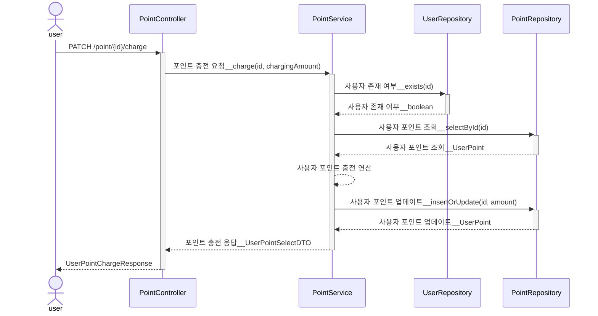
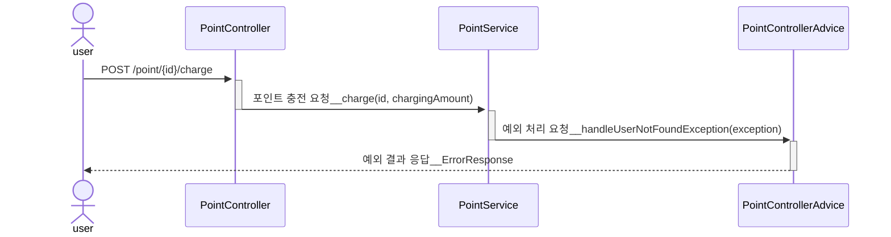
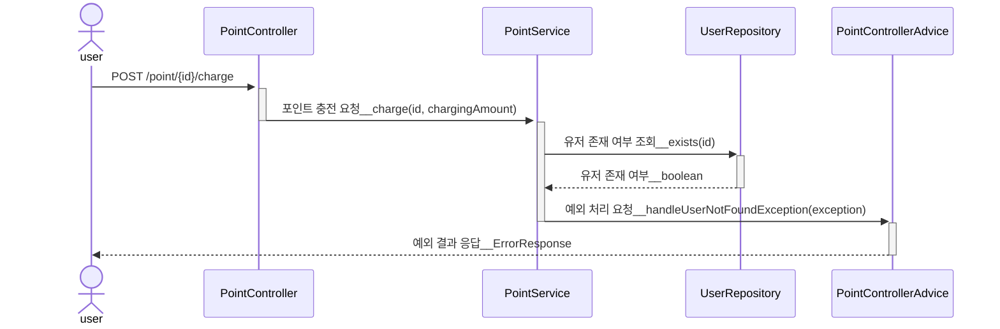
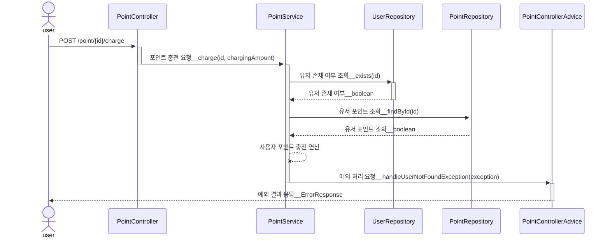

# [2] 유저 포인트 충전 API

## (1) 행동 분석

1. 충전 포인트, 유저 식별자를 파라미터로 입력 받는다.
2. 충전 포인트를 검증한다.
    - 충전 포인트 < 0 인 경우, 요청은 실패한다.
    - 충전 포인트 == 0 인 경우, 요청은 실패한다.
3. 유저 식별자를 검증한다.
   - 유저 식별자 < 0 인 경우, 요청은 실패한다.
   - 유저 식별자 == 0 인 경우, 요청은 실패한다.
   - 유저 식별자 > 0 && 미등록 유저인 경우, 요청은 실패한다.
4. 충전 포인트를 충전한다.
    - 1회 충전 최대 포인트 > 10만점인 경우, 요청은 실패한다.
5. 충전 결과를 응답한다.

## (2) 단위 테스트 케이스

### 1. PointService

| Pass/Fail |      type      |         input condition         | expected result                       |
|:---------:|:--------------:|:-------------------------------:|---------------------------------------|
|   Fail    |     point      |          충전 포인트 == 음수           | 예외 반환 (InvalidChargingPointException) |
|   Fail    |     point      |           충전 포인트 == 0           | 예외 반환 (InvalidChargingPointException) |
|   Fail    |     point      |       충전 포인트 > 최대 충전 포인트        | 예외 반환 (InvalidChargingPointException) |
|   Fail    |     userId     |          사용자 식별자 == 음수          | 예외 반환 (InvalidUserIdException)        |
|   Fail    |     userId     |          사용자 식별자 == 0           | 예외 반환 (InvalidUserIdException)        |
|   Fail    |     userId     |        양수 && 사용자 식별자 불일치        | 예외 반환 (UserNotFoundException)         |
|   Pass    | userId & point | (양수 && 사용자 식별자 일치) + 유효한 충전 포인트 | 포인트를 충전한다.                            |

### 2. PointController

| Pass/Fail |        |          user input           | expected status code | expected response body                                                 |
|:---------:|:------:|:-----------------------------:|:--------------------:|:-----------------------------------------------------------------------|
|   Fail    | point  |         충전 포인트 == 음수          |   bad request(400)   | {"code" : "CHARGING_POINT01", "message" : "충전 포인트는 음수일 수 없습니다."}       |
|   Fail    | point  |          충전 포인트 == 0          |   bad request(400)   | {"code" : "CHARGING_POINT02", "message" : "충전 포인트는 0일 수 없습니다."}        |
|   Fail    | point  |      충전 포인트 > 최대 충전 포인트       |   bad request(400)   | {"code" : "CHARGING_POINT03", "message" : "단일 포인트 충전은 최대 10만점 가능합니다."} |
|   Fail    | userId |         사용자 식별자 == 음수         |   bad request(400)   | {"code" : "MEMBER01", "message" : "유효하지 않는 유저 식별자 입니다."}               |
|   Fail    | userId |         사용자 식별자 == 0          |   bad request(400)   | {"code" : "MEMBER01", "message" : "유효하지 않는 유저 식별자 입니다."}               |
|   Fail    | userId |       양수 && 미등록 사용자 식별자       |   bad request(400)   | {"code" : "MEMBER02", "message" : "일치하는 유저가 존재하지 않습니다."}               |
|   Pass    | userId | 양수 && 사용자 식별자 일치 + 유효한 충전 포인트 |       ok(200)        | {"id" : "1", "point" : 200}                                            |

## (3) 시퀀스 다이어그램

### 1. 응답 성공 시퀀스

### 2. 응답 실패 시퀀스 : 유효하지 않는 유저 식별자 (유저 식별자 < 0 || 유저 식별자 == 0)

### 3. 응답 실패 시퀀스 : 사용자 식별자 > 0 && 미등록 사용자 식별자

### 3. 응답 실패 시퀀스 : 사용 포인트 > 1회 최대 사용 포인트

