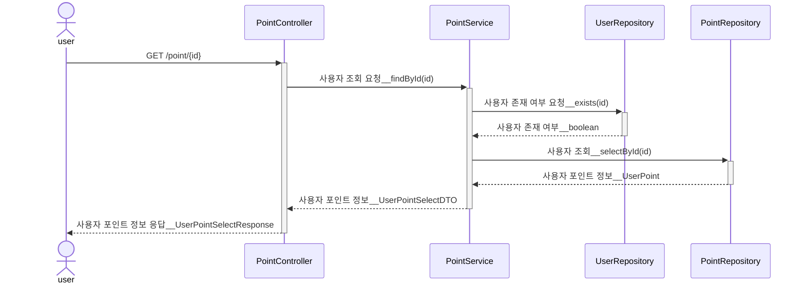
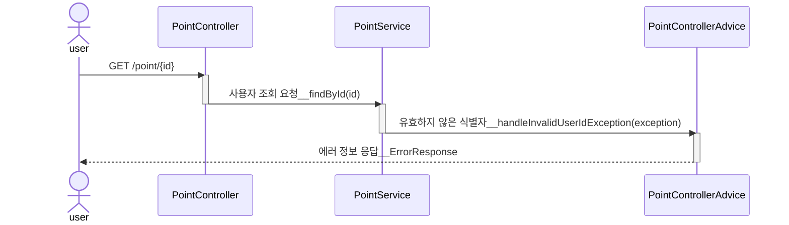
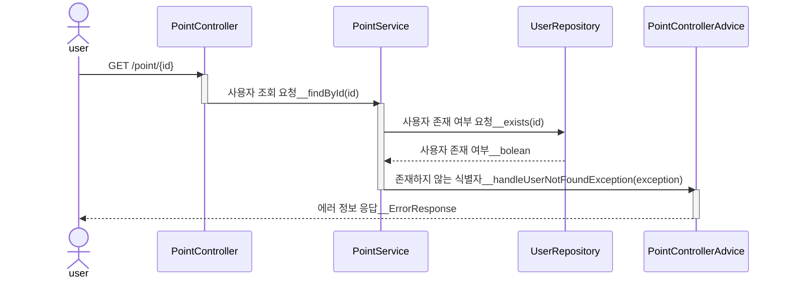

# [1] 특정 유저 포인트 API

## (1) 행동 분석

1. 유저 식별자를 전달 받는다.
2. 유저 식별자를 검증한다.
   - 유저 식별자 < 0 인 경우, 요청은 실패한다.
   - 유저 식별자 == 0 인 경우, 요청은 실패한다.
   - 유저 식별자 > 0 && 미등록 유저인 경우, 요청은 실패한다.
3. 유저 포인트를 조회한다.
4. 유저 아이디, 유저 포인트를 반환한다.

 

## (2) 단위 테스트 케이스

### 1. PointService

| Pass/Fail |    user input     | expected result               |
|:---------:|:-----------------:|-------------------------------|
|   Fail    |   사용자 식별자 == 음수   | 예외 반환 (InvalidUserIdException) |
|   Fail    |   사용자 식별자 == 0    | 예외 반환 (InvalidUserIdException) |
|   Fail    | 양수 && 사용자 식별자 불일치 | 예외 반환 (UserNotFoundException) |
|   Pass    | 양수 && 사용자 식별자 일치  | 사용자 포인트 정보를 를 반환한다            |

### 2. PointController

| Pass/Fail |    user input     | expected status code | expected response body                                   |
|:---------:|:-----------------:|:--------------------:|:---------------------------------------------------------|
|   Fail    |   사용자 식별자 == 음수   |   bad request(400)   | {"code" : "MEMBER01", "message" : "유효하지 않는 유저 식별자 입니다."} |
|   Fail    |   사용자 식별자 == 0    |   bad request(400)   | {"code" : "MEMBER01", "message" : "유효하지 않는 유저 식별자 입니다."} |
|   Fail    | 양수 && 미등록 사용자 식별자 |   bad request(400)   | {"code" : "MEMBER02", "message" : "일치하는 유저가 존재하지 않습니다."} |
|   Pass    | 양수 && 사용자 식별자 일치  |       ok(200)        | {"id" : "1", "point" : 200}                              |

 

## (3) 시퀀스 다이어그램

### 1. 응답 성공 시퀀스

### 2. 응답 실패 시퀀스 : 유효하지 않은 식별자 (사용자 식별자 < 0 || 사용자 식별자 == 0)

### 3. 응답 실패 시퀀스 : 사용자 식별자 > 0 && 미등록 사용자 식별자

