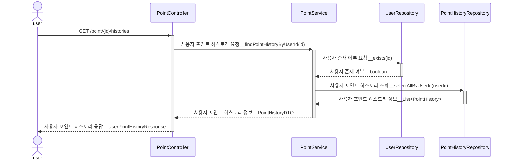
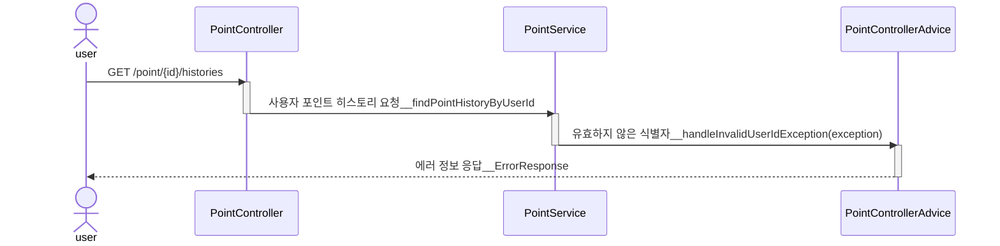
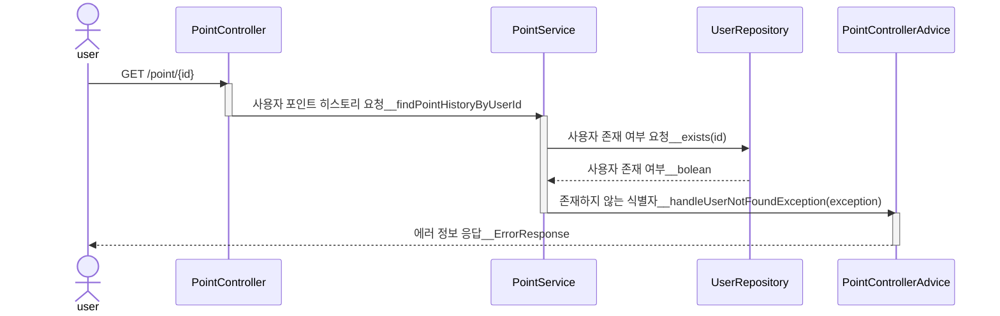

# [1] 포인트 충전/이용 내역 조회 API

## (1) 행동 분석

1. 유저 식별자를 전달 받는다.
2. 유저 식별자를 검증한다.
    - 유저 식별자 < 0 인 경우, 요청은 실패한다.
    - 유저 식별자 == 0 인 경우, 요청은 실패한다.
    - 유저 식별자 > 0 && 미등록 유저인 경우, 요청은 실패한다.
3. 유저 포인트 이용 내역을 조회한다.
4. 유저 아이디, 충전/이용 내역를 반환한다.
    - 이용 내역에는 아이디, 유저 아이디, 포인트, 트랜잭션 타입에 관한 정보를 포함한다.

## (2) 단위 테스트 케이스

### 1. PointService.history(id)

| Pass/Fail |      type      |              input condition              | expected result                | expected ErrorType 
|:---------:|:--------------:|:-----------------------------------------:|--------------------------------|:------------------:|
|   Fail    |     userId     |                사용자 식별자 < 0                | 예외 반환 (InvalidUserIdException) |  INVALID_USER_ID   |
|   Fail    |     userId     |               사용자 식별자 == 0                | 예외 반환 (InvalidUserIdException) |  INVALID_USER_ID   |
|   Fail    |     userId     |             양수 && 사용자 식별자 불일치             | 예외 반환 (UserNotFoundException)  |   USER_NOT_FOUND   |
|   Pass    | userId & point | (사용자 식별자 > 0) && 사용자 식별자 일치 && 유효한 사용 포인트 | 포인트를 사용에 성공한다.                 |         X          |

### 2. PointController.history(id)

| Pass/Fail |        |               user input                | expected status code | expected response body                                                                                                   |
|:---------:|:------:|:---------------------------------------:|:--------------------:|:-------------------------------------------------------------------------------------------------------------------------|
|   Fail    | userId |               사용자 식별자 < 0               |   bad request(400)   | {"code" : "MEMBER01", "message" : "유효하지 않는 유저 식별자 입니다."}                                                                 |
|   Fail    | userId |              사용자 식별자 == 0               |   bad request(400)   | {"code" : "MEMBER01", "message" : "유효하지 않는 유저 식별자 입니다."}                                                                 |
|   Fail    | userId |       사용자 식별자 > 0 && 미등록 사용자 식별자        |   bad request(400)   | {"code" : "MEMBER02", "message" : "일치하는 유저가 존재하지 않습니다."}                                                                 |
|   Pass    | userId | 사용자 식별자 > 0 && 사용자 식별자 일치 && 유효한 사용 포인트 |       ok(200)        | [{"id" : 1, "userId" : 1, "amount" : 2000, "type" : "USE"},{"id" : 2, "userId" : 1, "amount" : 1000, "type" : "CHARGE"}] |

## (3) 시퀀스 다이어그램

### 1. 응답 성공 시퀀스

### 2. 응답 실패 시퀀스 : 유효하지 않은 식별자 (사용자 식별자 < 0 || 사용자 식별자 == 0)

### 3. 응답 실패 시퀀스 : 사용자 식별자 > 0 && 미등록 사용자 식별자

